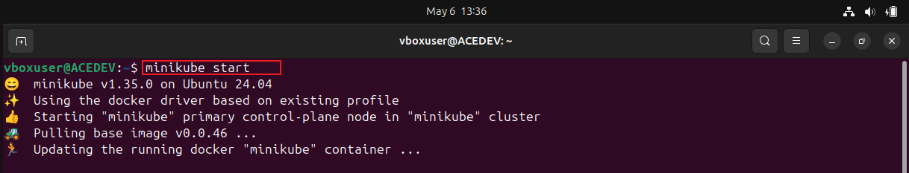
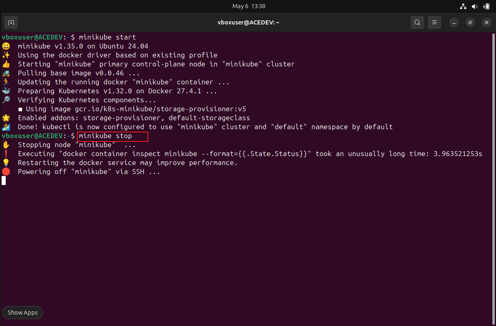
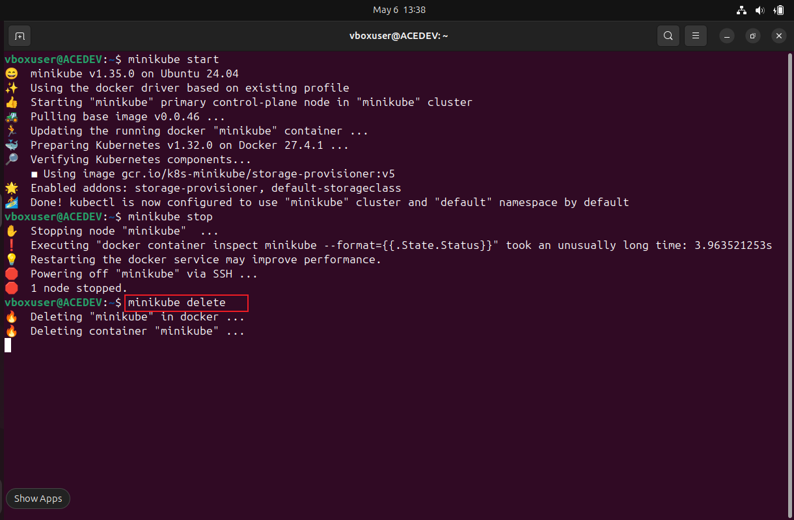
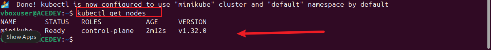
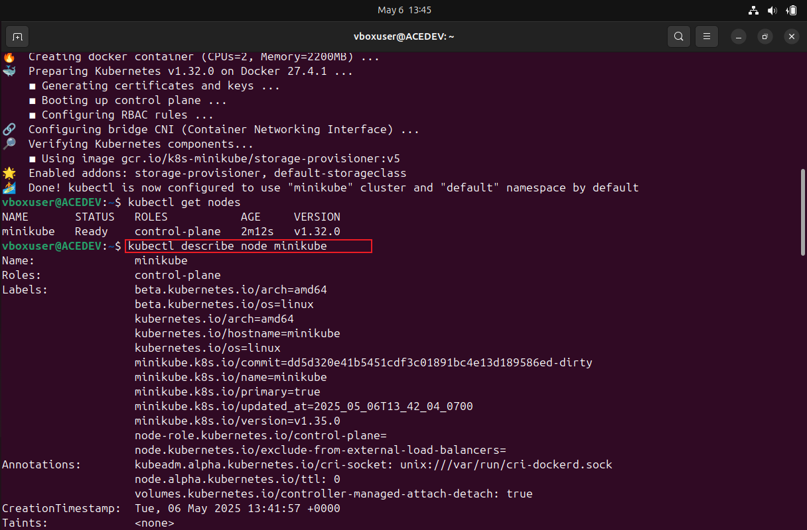

# kubernetes-Node
Diving into nodes on kubernetes

* Start Minikube cluster using thge command:
   
    minikube start

* Stop Minikube cluster :

    minikube stop

* DeleteMinikube Cluster:
    
    minikube delete

* View Node :
   
    kubectl get nodes

* Inspect Node :

    kubectl describe node <minikube>

 In summary minikube is often used for local development and testing, scaling nodes may not be as critical in production environment. However by efectively managing nodes in minikube kubernetes cluster, we can create, test, and deploy applications locally, simulating a kubernetes cluster without the need for a full-scale production setup which is useful for debugging, experimenting and developing applications in a controlled environment.